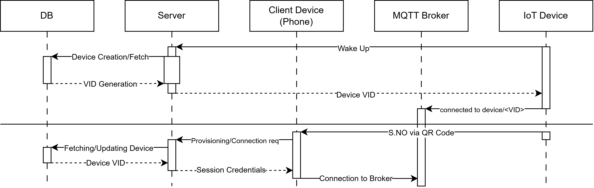

# IoT Provisioning & Management Backend Service

- [Directory Structure](docs/SRC_STRUCTURE.md)
- [Frontend Integration Guide](docs/mqtt_frontend_connection_guide.md)

Command for generating updated directory structure

```bash
npm run docs:src
```

## Commands

Detailed Commands documentation for testing/deployment:

- [Local Testing](docs/commands/local_commands.md): Commands for local development and testing
- [Deployment Commands](docs/commands/deployment_commands.md): All Commands needed while deployment
- [Testing Commands](docs/commands/testing_commands.md): Commands for testing

## API Documentation

Detailed documentation for all backend API endpoints is available here:

- [Provision Device API](docs/api/provision.md): Registers and provisions a device to a specific user.
- [Device Wake-up & Registration API](docs/api/wakeup.md): Registers a new device or updates the state of an existing device.
- [Connect Device API](docs/api/connect.md): Generates JWT-based MQTT credentials for provisioned devices.
- [Get Device(s) API](docs/api/get.md): Retrieves device(s) configuration by device ID or owner/user ID.
- [Remove Device API](docs/api/remove.md): Unlinks a device from an owner or completely deletes it from the database.

## Povisioning Sequence

