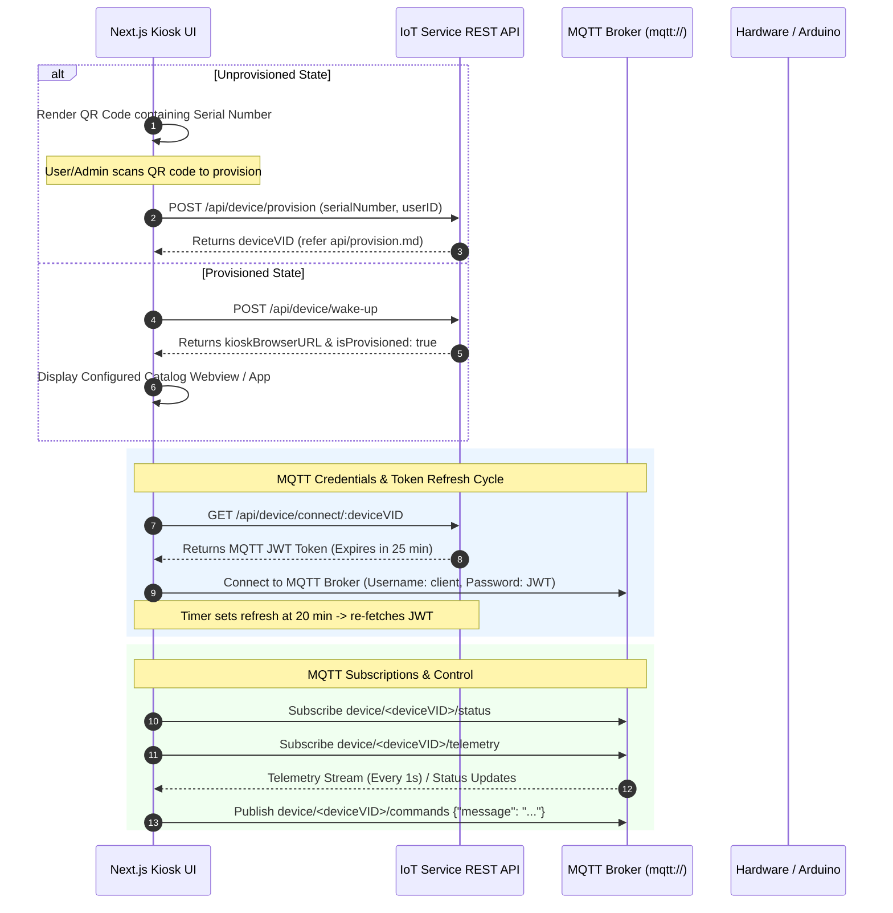

# M9Vends IoT Service — Frontend MQTT Connection & Integration Guide (Next.js)

## 1. Overview & System Architecture

This guide provides a comprehensive technical reference for developer teams at **M9Vends** building client-side web applications (such as Next.js kiosk interfaces, admin portals, or customer dashboards) that integrate with the M9Vends IoT Backend Service via **MQTT**.

### 1.1 High-Level Flow Overview



---

## 2. Device Lifecycle & Provisioning Flow

### 2.1 UI State Selection (Provisioned vs. Unprovisioned)

When the Next.js kiosk frontend initializes on a physical vending or display device:

1. **Unprovisioned State**:
   - If the device is not yet provisioned to a user or store, the frontend **must render a QR Code** containing the device's unique hardware `serialNumber`.
   - Admin/Users scan this QR code to initiate the provisioning API request.
   - Refer to the [`Device Provisioning API Documentation`](./api/provision.md) for endpoint specifications (`POST /api/device/provision`).
   
2. **Provisioned State**:
   - Once provisioned, the API returns `isProvisioned: true` and the configured `kioskBrowserURL` (set via backend environment variables).
   - The display should immediately load and render the configured catalog application URL.

> [!IMPORTANT]  
> **Device System Virtual ID (`deviceVID`)**:  
> Always obtain `deviceVID` directly from backend API responses (e.g. [`provision.md`](./api/provision.md) or [`wakeup.md`](./api/wakeup.md)). **Do NOT generate or invent a `deviceVID` on the client side.**

### 2.2 Related API Documentation Links

- 📡 [`Device Wake-up & Registration API`](./api/wakeup.md) — Registration, state sync, and initial configuration payload.
- 🔑 [`Device Provisioning API`](./api/provision.md) — Link a serial number to a user and obtain the system `deviceVID`.
- 🔌 [`Connect Device API`](./api/connect.md) — Generate short-lived JWT-based MQTT broker connection credentials.

---

## 3. MQTT Authentication & Token Lifecycle

### 3.1 Protocol Specifications

- **Protocol**: Standard unencrypted MQTT (`mqtt://` on port:1883) or WebSocket (`ws://` on port:8083, `wss://` on port:8084 for web browsers).
- **Security Notice**: **This service uses MQTT, NOT MQTTS.**
- **Broker Endpoint**: The MQTT Broker host URL is defined in the IoT Service environment variables.

### 3.2 Authentication via JWT

To establish a broker connection, the client must first fetch a JWT token via the Connect API endpoint:

- **Endpoint**: `GET /api/device/connect/:deviceVID` (See [`connect.md`](./api/connect.md))
- **JWT Password**: Use the returned `token` string as the MQTT connection **`password`**.

```json
{
  "message": "Successfully generated mqtt credentials",
  "mqttCredentials": {
    "token": "eyJhbGciOiJIUzI1NiIsInR5cCI6IkpXVCJ9...",
    "expiresIn": "25m"
  }
}
```

### 3.3 Token Expiration & Automated Re-authentication Strategy

- **Token Expiry**: The JWT token issued by the backend expires in **25 minutes**.
- **Renewal Mechanism**: The frontend client **must automatically refresh the JWT token** by calling `GET /api/device/connect/:deviceVID` before expiration (e.g. every **20 minutes**).
- **Seamless Reconnection**: Upon receiving a fresh token, update the stored credential and perform a smooth reconnect to the MQTT broker without resetting UI state or dropping user operations.

---

## 4. MQTT Topic Architecture

All MQTT topic paths are strictly scoped using the device's system virtual ID (`deviceVID`).

```
device/
└── <deviceVID>/
    ├── status      (Subscribe - Online / Offline)
    ├── telemetry   (Subscribe - Sensor JSON, Error Text, Anomaly Text)
    └── commands    (Publish   - Command JSON Envelopes)
```

| Action | Topic Path | Description |
| :--- | :--- | :--- |
| **Subscribe** | `device/<deviceVID>/status` | Tracks physical device connectivity state |
| **Subscribe** | `device/<deviceVID>/telemetry` | Real-time sensor telemetry payload stream (1 Hz) and system alerts |
| **Publish** | `device/<deviceVID>/commands` | Dispatch action commands to the device hardware |

---

## 5. Topic Payloads & Data Specifications

### 5.1 Status Topic (`device/<deviceVID>/status`)

Receives raw string updates regarding device connectivity.

- **Format**: Plain Text (`string`)
- **Possible Values**:
  - `"online"` — Hardware device is connected and active.
  - `"offline"` — Hardware device has disconnected or timed out.

---

### 5.2 Telemetry & Alerts Topic (`device/<deviceVID>/telemetry`)

When online, the device publishes updates to this topic **every 1 second**. The frontend must handle **two data formats**: standard JSON telemetry objects and string-based status/anomaly alerts.

#### 1. Standard Operational Telemetry (JSON Object)
When hardware is functioning normally:

```json
{
    "Steering Motor Temperature": 28,
    "Tank Levels": [
        25,
        50,
        40,
        10
    ],
    "Steering Motor": true,
    "Current Sensor": 250
}
```

**Field Descriptions & Units**:
- `Steering Motor Temperature` (`number`): Internal motor temperature in Celsius (°C).
- `Tank Levels` (`array of numbers`): Percentage fill level (`0`–`100%`) for all 4 liquid tanks in index order (`[Tank 1, Tank 2, Tank 3, Tank 4]`).
- `Steering Motor` (`boolean`): Active operational state (`true` = Running/ON, `false` = Idle/OFF).
- `Current Sensor` (`number`): Current draw measured in milliamperes (`mA`).

#### 2. Hardware Disconnected Alert (Text Message)
If the backend or telemetry agent cannot read hardware sensors (e.g., Arduino disconnected or unconfigured):

```text
Device(Arduino) Not Connected
```

#### 3. Anomaly Detected Alert (Text Message)
When a hardware fault or out-of-range sensor condition is triggered:

```text
Anomaly Detected
```

> [!WARNING]  
> **TypeScript Handling**: Always parse payload content safely. Try parsing incoming buffers as JSON first; if JSON parsing fails, process the payload as a status/anomaly alert string.

---

### 5.3 Command Dispatch Topic (`device/<deviceVID>/commands`)

To execute hardware actions, publish a JSON message envelope to `device/<deviceVID>/commands`.

#### Standard Envelope Format

```json
{
  "message": "<your command>"
}
```

#### Supported Hardware Commands

1. **`getDataFromHardware`**:
   - **Description**: Requests an immediate telemetry read from hardware without waiting for the next 1-second periodic tick.
   - **Payload**:
     ```json
     {
       "message": "getDataFromHardware"
     }
     ```
   - **Response**: Triggers an immediate JSON telemetry response on `device/<deviceVID>/telemetry`.

2. **`toggleSteeringMotor`**:
   - **Description**: Toggles the steering motor state (`ON` -> `OFF` or `OFF` -> `ON`).
   - **Payload**:
     ```json
     {
       "message": "toggleSteeringMotor"
     }
     ```
   - **Response**: Executes toggle action and publishes an updated telemetry JSON payload on `device/<deviceVID>/telemetry`.

---

## 6. Next.js Client Implementation Guide

Below is a production-ready Next.js / React integration pattern using TypeScript and the official [`mqtt`](https://www.npmjs.com/package/mqtt) client library.

### 6.1 Custom Hook: `useMqttClient.ts`

Create a reusable custom hook `hooks/useMqttClient.ts` to manage JWT authentication, token auto-refresh, broker connection, topic subscriptions, and command publishing.

```typescript
import { useEffect, useState, useRef, useCallback } from 'react';
import mqtt, { MqttClient } from 'mqtt';

export interface TelemetryData {
  'Steering Motor Temperature': number;
  'Tank Levels': [number, number, number, number];
  'Steering Motor': boolean;
  'Current Sensor': number;
}

export type ConnectionStatus = 'disconnected' | 'connecting' | 'connected' | 'error';

interface UseMqttClientProps {
  deviceVID: string;
  brokerUrl: string; // e.g. process.env.NEXT_PUBLIC_MQTT_BROKER_URL or ws://broker-ip:9001
  apiBaseUrl?: string;
}

export function useMqttClient({ deviceVID, brokerUrl, apiBaseUrl = '' }: UseMqttClientProps) {
  const [status, setStatus] = useState<ConnectionStatus>('disconnected');
  const [deviceStatus, setDeviceStatus] = useState<'online' | 'offline' | 'unknown'>('unknown');
  const [telemetry, setTelemetry] = useState<TelemetryData | null>(null);
  const [hardwareAlert, setHardwareAlert] = useState<string | null>(null);
  const [anomalyAlert, setAnomalyAlert] = useState<boolean>(false);

  const clientRef = useRef<MqttClient | null>(null);
  const refreshTimerRef = useRef<NodeJS.Timeout | null>(null);

  // 1. Fetch MQTT Credentials (JWT) from Connect API (refer ./api/connect.md)
  const fetchMqttJwt = useCallback(async (): Promise<string | null> => {
    try {
      const response = await fetch(`${apiBaseUrl}/api/device/connect/${deviceVID}`);
      if (!response.ok) {
        throw new Error(`Failed to fetch connect credentials: ${response.statusText}`);
      }
      const data = await response.json();
      return data?.mqttCredentials?.token || null;
    } catch (err) {
      console.error('[MQTT Auth Error] Failed to get JWT token:', err);
      return null;
    }
  }, [deviceVID, apiBaseUrl]);

  // 2. Connect / Reconnect to MQTT Broker
  const connectBroker = useCallback(async () => {
    if (!deviceVID) return;

    setStatus('connecting');
    const jwtToken = await fetchMqttJwt();

    if (!jwtToken) {
      setStatus('error');
      console.error('[MQTT] Aborting connection: Unable to fetch valid JWT password.');
      return;
    }

    // Disconnect existing instance before reconnecting
    if (clientRef.current) {
      clientRef.current.end(true);
    }

    // Notice: Protocol is mqtt / ws (non-SSL) as configured
    const client = mqtt.connect(brokerUrl, {
      username: 'FrontendClient',
      password: jwtToken, // Pass JWT token as password
      clientId: `nextjs_client_${Math.random().toString(16).substring(2, 10)}`,
      keepalive: 60,
      reconnectPeriod: 5000,
    });

    client.on('connect', () => {
      console.log(`[MQTT] Connected successfully to broker for device: ${deviceVID}`);
      setStatus('connected');

      // Subscribe to Device Topics (refer Section 4)
      const statusTopic = `device/${deviceVID}/status`;
      const telemetryTopic = `device/${deviceVID}/telemetry`;

      client.subscribe([statusTopic, telemetryTopic], (err) => {
        if (err) {
          console.error('[MQTT] Subscription error:', err);
        } else {
          console.log(`[MQTT] Subscribed to ${statusTopic} and ${telemetryTopic}`);
        }
      });
    });

    client.on('message', (topic, payload) => {
      const rawMessage = payload.toString();

      if (topic === `device/${deviceVID}/status`) {
        if (rawMessage === 'online' || rawMessage === 'offline') {
          setDeviceStatus(rawMessage);
        }
      } else if (topic === `device/${deviceVID}/telemetry`) {
        // Handle special text messages first
        if (rawMessage === 'Device(Arduino) Not Connected') {
          setHardwareAlert('Device(Arduino) Not Connected');
          return;
        }

        if (rawMessage === 'Anomaly Detected') {
          setAnomalyAlert(true);
          return;
        }

        // Clear alerts on valid telemetry reception
        setHardwareAlert(null);

        // Attempt parsing JSON operational telemetry payload
        try {
          const parsedTelemetry: TelemetryData = JSON.parse(rawMessage);
          setTelemetry(parsedTelemetry);
        } catch (err) {
          console.warn('[MQTT Payload Warning] Unrecognized message payload:', rawMessage);
        }
      }
    });

    client.on('error', (err) => {
      console.error('[MQTT Client Error]', err);
      setStatus('error');
    });

    client.on('close', () => {
      setStatus('disconnected');
    });

    clientRef.current = client;

    // 3. Schedule Automatic JWT Refresh (Every 20 Minutes)
    // JWT expires in 25 mins; refresh at 20 mins to prevent disruption.
    if (refreshTimerRef.current) clearTimeout(refreshTimerRef.current);
    refreshTimerRef.current = setTimeout(() => {
      console.log('[MQTT] 20m Token refresh timer triggered. Refreshing connection...');
      connectBroker();
    }, 20 * 60 * 1000);

  }, [deviceVID, brokerUrl, fetchMqttJwt]);

  // 4. Send Command Helper (Publish to device/<deviceVID>/commands)
  const sendCommand = useCallback((commandName: 'getDataFromHardware' | 'toggleSteeringMotor') => {
    if (!clientRef.current || status !== 'connected') {
      console.warn('[MQTT] Cannot send command: Client is not connected.');
      return;
    }

    const commandTopic = `device/${deviceVID}/commands`;
    const payload = JSON.stringify({ message: commandName });

    clientRef.current.publish(commandTopic, payload, { qos: 1 }, (err) => {
      if (err) {
        console.error(`[MQTT] Failed to publish command '${commandName}':`, err);
      } else {
        console.log(`[MQTT] Published command '${commandName}' to ${commandTopic}`);
      }
    });
  }, [deviceVID, status]);

  useEffect(() => {
    connectBroker();

    return () => {
      if (refreshTimerRef.current) clearTimeout(refreshTimerRef.current);
      if (clientRef.current) clientRef.current.end(true);
    };
  }, [connectBroker]);

  return {
    connectionStatus: status,
    deviceStatus,
    telemetry,
    hardwareAlert,
    anomalyAlert,
    clearAnomalyAlert: () => setAnomalyAlert(false),
    sendCommand,
  };
}
```

---

### 6.2 Next.js Dashboard & Provisioning Component Example

Below is a sample Next.js React component (`components/KioskDashboard.tsx`) demonstrating how to handle both the **Provisioning UI State** (QR code scanning) and the **Live MQTT Telemetry Dashboard**.

```tsx
import React, { useState } from 'react';
import { QRCodeSVG } from 'qrcode.react'; // Install via: npm install qrcode.react
import { useMqttClient } from '../hooks/useMqttClient';

interface KioskDashboardProps {
  serialNumber: string; // Device hardware serial
  initialDeviceVID?: string; // Provided if already provisioned
  kioskCatalogUrl?: string; // Configured catalog URL
}

export const KioskDashboard: React.FC<KioskDashboardProps> = ({
  serialNumber,
  initialDeviceVID,
  kioskCatalogUrl,
}) => {
  const [deviceVID, setDeviceVID] = useState<string | undefined>(initialDeviceVID);
  const [isProvisioned, setIsProvisioned] = useState<boolean>(!!initialDeviceVID);

  const brokerUrl = process.env.NEXT_PUBLIC_MQTT_BROKER_URL || 'ws://localhost:9001';

  // Instantiate MQTT custom hook when provisioned & VID is present
  const {
    connectionStatus,
    deviceStatus,
    telemetry,
    hardwareAlert,
    anomalyAlert,
    clearAnomalyAlert,
    sendCommand,
  } = useMqttClient({
    deviceVID: deviceVID || '',
    brokerUrl,
  });

  // Simulated handler for when device gets provisioned
  const handleProvisionSuccess = (newVID: string) => {
    // Note: Do not generate vid on frontend; use vid from POST /api/device/provision
    setDeviceVID(newVID);
    setIsProvisioned(true);
  };

  // State 1: UNPROVISIONED STATE -> Display QR Code for Provisioning
  if (!isProvisioned || !deviceVID) {
    return (
      <div className="flex flex-col items-center justify-center min-h-screen bg-gray-900 text-white p-6">
        <h1 className="text-3xl font-bold mb-4">Device Provisioning Required</h1>
        <p className="text-gray-400 mb-6 text-center max-w-md">
          Scan this QR code using the M9Vends Admin Mobile App to provision this vending machine.
        </p>

        {/* QR Code containing hardware serial number */}
        <div className="p-4 bg-white rounded-xl shadow-lg mb-4">
          <QRCodeSVG value={serialNumber} size={220} />
        </div>

        <p className="text-sm font-mono text-gray-400 mb-6">Serial No: {serialNumber}</p>
        <p className="text-xs text-gray-500">
          Refer to <a href="./api/provision.md" className="underline text-blue-400">api/provision.md</a> for API setup.
        </p>
      </div>
    );
  }

  // State 2: PROVISIONED STATE -> Display Live MQTT Telemetry & Commands UI
  return (
    <div className="min-h-screen bg-gray-950 text-slate-100 p-8 font-sans">
      {/* Header Bar */}
      <header className="flex justify-between items-center pb-6 border-b border-gray-800 mb-8">
        <div>
          <h1 className="text-2xl font-extrabold text-blue-400">M9Vends Kiosk Control Center</h1>
          <p className="text-xs font-mono text-gray-400">Device VID: {deviceVID}</p>
        </div>

        <div className="flex items-center gap-4">
          {/* Connection Status Indicator */}
          <span className="text-sm">
            MQTT: <strong className="uppercase">{connectionStatus}</strong>
          </span>
          <span className={`px-3 py-1 rounded-full text-xs font-bold uppercase ${
            deviceStatus === 'online' ? 'bg-green-600 text-white' : 'bg-red-600 text-white'
          }`}>
            Device {deviceStatus}
          </span>
        </div>
      </header>

      {/* Alert Notifications */}
      {hardwareAlert && (
        <div className="bg-red-900/80 border border-red-500 text-red-200 p-4 rounded-lg mb-6 flex justify-between items-center">
          <span>⚠️ <strong>Hardware Warning:</strong> {hardwareAlert}</span>
        </div>
      )}

      {anomalyAlert && (
        <div className="bg-amber-900/80 border border-amber-500 text-amber-200 p-4 rounded-lg mb-6 flex justify-between items-center">
          <span>🚨 <strong>System Alert:</strong> Anomaly Detected on Device Sensors!</span>
          <button 
            onClick={clearAnomalyAlert}
            className="px-3 py-1 bg-amber-700 hover:bg-amber-600 text-white text-xs rounded"
          >
            Dismiss
          </button>
        </div>
      )}

      {/* Main Control & Telemetry Grid */}
      <div className="grid grid-cols-1 md:grid-cols-2 gap-6">
        
        {/* Real-time Telemetry Card */}
        <div className="bg-gray-900 border border-gray-800 p-6 rounded-xl shadow-md">
          <h2 className="text-lg font-semibold mb-4 text-blue-300">Live Telemetry Data (1 Hz)</h2>
          
          {telemetry ? (
            <div className="space-y-4">
              <div className="flex justify-between border-b border-gray-800 pb-2">
                <span className="text-gray-400">Steering Motor Temperature:</span>
                <span className="font-mono font-bold text-lg">{telemetry['Steering Motor Temperature']} °C</span>
              </div>

              <div className="flex justify-between border-b border-gray-800 pb-2">
                <span className="text-gray-400">Current Sensor Draw:</span>
                <span className="font-mono font-bold text-lg">{telemetry['Current Sensor']} mA</span>
              </div>

              <div className="flex justify-between border-b border-gray-800 pb-2">
                <span className="text-gray-400">Steering Motor Status:</span>
                <span className={`font-bold ${telemetry['Steering Motor'] ? 'text-green-400' : 'text-gray-500'}`}>
                  {telemetry['Steering Motor'] ? 'ACTIVE (ON)' : 'IDLE (OFF)'}
                </span>
              </div>

              {/* Tank Levels Display */}
              <div className="pt-2">
                <span className="text-gray-400 text-sm block mb-2">Tank Fill Levels (%):</span>
                <div className="grid grid-cols-4 gap-2">
                  {telemetry['Tank Levels'].map((level, idx) => (
                    <div key={idx} className="bg-gray-800 p-3 rounded-lg text-center">
                      <span className="text-xs text-gray-400 block mb-1">Tank {idx + 1}</span>
                      <span className="font-mono font-bold text-blue-400">{level}%</span>
                    </div>
                  ))}
                </div>
              </div>
            </div>
          ) : (
            <p className="text-gray-500 italic">Waiting for telemetry stream...</p>
          )}
        </div>

        {/* Command Control Panel */}
        <div className="bg-gray-900 border border-gray-800 p-6 rounded-xl shadow-md flex flex-col justify-between">
          <div>
            <h2 className="text-lg font-semibold mb-4 text-blue-300">Hardware Command Controls</h2>
            <p className="text-sm text-gray-400 mb-6">
              Dispatches JSON command envelopes to <code className="text-xs bg-gray-800 p-1 rounded">device/{deviceVID}/commands</code>.
            </p>

            <div className="space-y-4">
              <button
                onClick={() => sendCommand('getDataFromHardware')}
                disabled={connectionStatus !== 'connected'}
                className="w-full py-3 bg-blue-600 hover:bg-blue-500 disabled:bg-gray-800 text-white font-semibold rounded-lg transition"
              >
                📡 Force Read Telemetry (getDataFromHardware)
              </button>

              <button
                onClick={() => sendCommand('toggleSteeringMotor')}
                disabled={connectionStatus !== 'connected'}
                className="w-full py-3 bg-purple-600 hover:bg-purple-500 disabled:bg-gray-800 text-white font-semibold rounded-lg transition"
              >
                ⚙️ Toggle Steering Motor (toggleSteeringMotor)
              </button>
            </div>
          </div>

          {/* Configured Catalog Link */}
          {kioskCatalogUrl && (
            <div className="mt-8 pt-4 border-t border-gray-800 text-center">
              <a
                href={kioskCatalogUrl}
                target="_blank"
                rel="noreferrer"
                className="text-sm text-blue-400 hover:underline"
              >
                🔗 Open Configured Kiosk Catalog Webview
              </a>
            </div>
          )}
        </div>

      </div>
    </div>
  );
};
```

---

## 7. Developer Checklist & Best Practices

1. **Do Not Synthesize `deviceVID`**: Always obtain `deviceVID` via the backend response when provisioning ([`api/provision.md`](./api/provision.md)).
2. **Strict Protocol**: Use unencrypted `mqtt://` (or `ws://` for web clients). Do NOT configure `mqtts://`.
3. **Automate JWT Renewal**: Set a timer to execute JWT re-authentication via [`api/connect.md`](./api/connect.md) **every 20 minutes** (5 minutes prior to the 25-minute expiration boundary).
4. **Resilient Payload Parsing**: Always handle non-JSON string payloads (`"Anomaly Detected"`, `"Device(Arduino) Not Connected"`) safely to avoid `JSON.parse` runtime exceptions.
5. **Exact Command Envelope Format**: Publish commands formatted strictly as `{"message": "<commandName>"}`.
