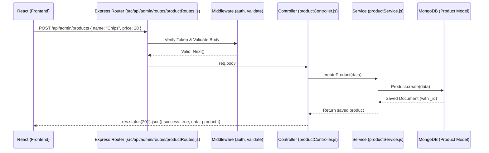

# Folder Walkthrough

As a frontend developer, you won't modify the backend often, but understanding its structure helps you trace how your API calls are processed. 

### `src/api/`
**Purpose**: Defines the URLs (endpoints), handles incoming HTTP requests, and sends HTTP responses.
- **`routes/`**: Contains files that map a specific URL (like `POST /login`) to a specific function (controller). Split into `admin` (requires JWT) and `public` (for vending machines/customers).
- **`controllers/`**: The functions triggered by the routes. They extract data from `req.body` or `req.params`, pass it to the `services`, and then format the output with `res.json()`.
- **`middlewares/`**: Functions that run *before* the controller. They check if the user is logged in (`authMiddleware`), if they have the right role (`rbacMiddleware`), or validate incoming data.
**Frontend Interaction**: You look at `routes` to know what URL to call, and `controllers` to see what exact JSON shape is expected/returned.

### `src/config/`
**Purpose**: Configuration files that set up connections to external systems.
- **Important files**: `db.js` (connects to MongoDB).
**Frontend Interaction**: None directly. 

### `src/models/`
**Purpose**: Defines the structure (schema) of the data saved in the database using Mongoose.
- **Important files**: `User.js`, `Product.js`, `Order.js`, `Device.js`, etc.
**Frontend Interaction**: **Highly important.** The schemas here dictate exactly what fields you will receive in API responses and what fields you must send. For example, if `Product.js` has `image_url`, you know you can expect that field on the frontend.

### `src/services/`
**Purpose**: The "brain" of the application. Contains all the complex business logic, database queries, and calculations. Controllers just pass data here, and services do the heavy lifting.
- **Important files**: `orderService.js` (creates Razorpay orders), `analyticsService.js` (aggregates revenue data).
**Frontend Interaction**: None directly, but if you want to know *how* total revenue is calculated, this is where you look.

### `src/utils/`
**Purpose**: Reusable helper functions that don't belong to any specific feature.
- **Important files**: `ApiError.js` (standardized error formats), `jwt.js` (token generation), `validate.js` (Zod validation wrapper).
**Frontend Interaction**: Look at `ApiError.js` to understand the standard format of errors you will receive on the frontend.

*Will you ever modify these?* Rarely. You might look at them to debug why your API call is failing, but you won't write code here unless you transition to full-stack.

---

# Request Lifecycle

What happens when your React app calls a backend API? 

Let's trace a call to create a new product: `POST /api/admin/products`

1. **React**: You use Axios to send a POST request with the JWT token in the headers.
2. **Express Route**: The backend receives it at `/api/admin/products`.
3. **Middlewares**: `authMiddleware` checks if your token is valid. The `validate` middleware checks if your payload matches the Zod schema. If invalid, it immediately returns a 400 error to React.
4. **Controller**: `createProduct` in `productController.js` takes `req.body` and passes it to the service layer.
5. **Service**: `createProduct` in `productService.js` adds the `company_id` from the logged-in user and saves it to the database.
6. **Database**: MongoDB creates the record and generates an `_id` and `createdAt` timestamp.
7. **Response**: The Controller wraps the result in `{ success: true, data: {...} }` and sends it back to your Axios call.
