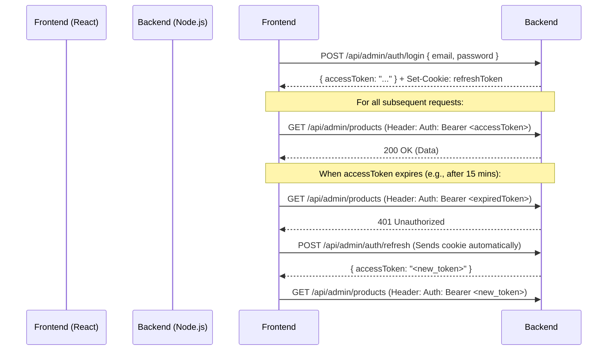

# Authentication Guide

This project uses JWT (JSON Web Tokens) for authentication. As a frontend dev, you need to understand how tokens are issued, stored, and sent.

## Step-by-Step Flow



### 1. Login
- Call `POST /api/admin/auth/login` with email/password.
- The backend responds with an `accessToken` (short-lived, e.g., 1 day or 15 mins).
- The backend also sets a `refreshToken` in an **HTTP-only cookie**. This is important because JS cannot access HTTP-only cookies, protecting against XSS attacks.

### 2. Storing Tokens
- **Where to store `accessToken`**: In memory (React state/Context/Zustand) or LocalStorage/SessionStorage. (Local storage is easiest but slightly less secure. Memory + Refresh logic is best practice).
- **Where to store `refreshToken`**: You don't! The browser stores it automatically in the cookie jar.

### 3. Calling Protected APIs
Whenever you call an `/api/admin/*` route, you must attach the access token to the Axios headers:
```javascript
const response = await axios.get('/api/admin/products', {
  headers: {
    Authorization: `Bearer ${localStorage.getItem('accessToken')}`
  }
});
```

### 4. Handling Expiry (Refresh Token)
If an API returns a **401 Unauthorized**, your `accessToken` has expired.
You must:
1. Catch the 401 error.
2. Call `POST /api/admin/auth/refresh` (Axios must have `withCredentials: true` to send the cookie).
3. If refresh succeeds, save the new `accessToken` and retry the original failed request.
4. If refresh fails (token expired/invalid), force the user to the `/login` screen.

### 5. Logout
Call `POST /api/admin/auth/logout`. The backend will clear the HTTP-only cookie and remove the refresh token from the database. You should then clear your local `accessToken` and redirect to the login page.
